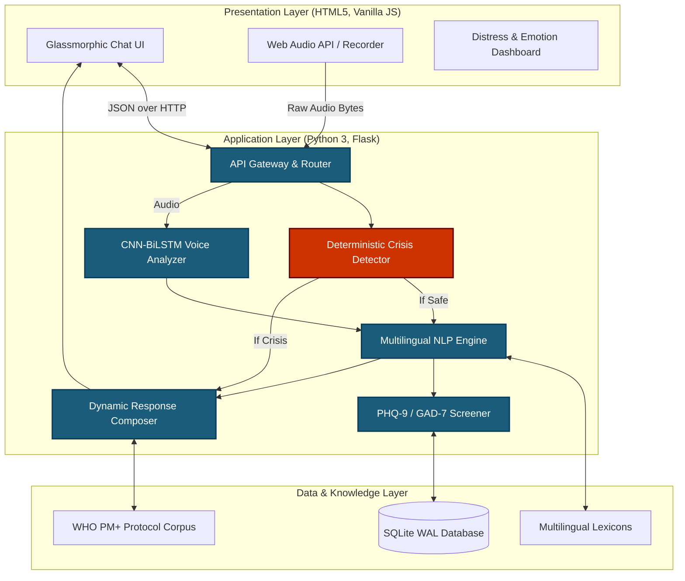
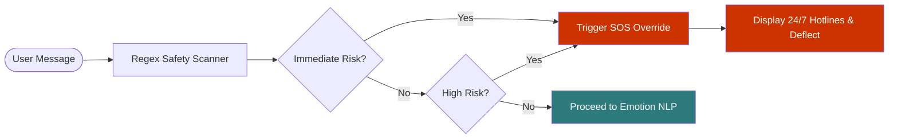
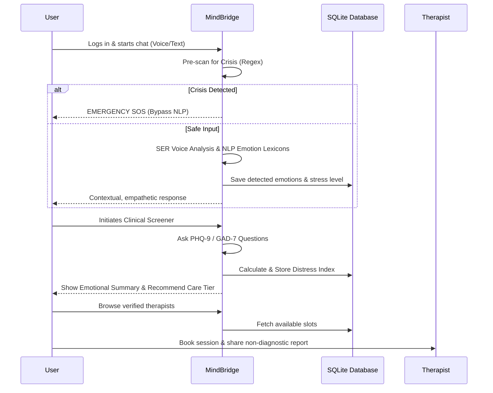

# 🌿 MindBridge — AI-Powered Mental Health Screening & Care Navigation

> **A supportive, scientifically-grounded, and non-judgmental first step toward professional mental health care.**

MindBridge is an advanced conversational platform built to address the massive "treatment gap" in global mental health. By providing voice- and text-enabled emotional exploration, it allows users to safely articulate their feelings of stress, anxiety, burnout, and grief. 

Powered by **Custom NLP pipelines**, a **CNN-BiLSTM Speech Emotion Recognition network**, and validated **PHQ-9 and GAD-7 clinical instruments**, MindBridge calculates non-diagnostic distress levels. It incorporates strict **ethical guardrails**, an **immediate deterministic 24/7 crisis safety protocol**, and a tiered recommendation engine to connect users to **verified psychologists and psychiatrists**.

---

## 🏛️ System Architecture

MindBridge operates on a strictly separated three-layer architecture designed for low-latency conversational processing and immediate crisis intervention.



---

## 🌟 Core Capabilities & Algorithmic Engines

### 1. 💬 Multilingual Empathetic Conversational Check-in
- **Language Detection Engine**: Fully supports **English, Hindi (हिन्दी), Hinglish, and Bengali (বাংলা)**. Language detection is driven by Unicode script parsing (detecting Devanagari/Bengali characters) and English stopword ratio analysis.
- **Dynamic Response Composer**: Responses are generated using a 5-phase assembly model (Greet → Mirror → Validate → Ask → Ground), pulling from hundreds of topic-specific empathetic templates rather than sounding like a generic robotic chatbot.
- **Voice Context & TTS**: Features real-time microphone audio recording and soothing voice playback.

### 2. 🛡️ Absolute Safety: Deterministic Crisis Detection
Safety cannot rely on AI hallucinations. MindBridge implements a deterministic override layer.



- **Pre-Screening Regex Gate**: Before any AI or LLM processing occurs, user input is scanned by a deterministic regex engine across 3 risk tiers (Immediate, High, Moderate). 
- **SOS Override**: Any expression of self-harm, suicidal ideation, or severe distress instantly short-circuits the conversation and triggers an Emergency SOS Intervention with 1-tap dial buttons for verified 24/7 national hotlines.
- **Non-Diagnostic Shield**: The system never uses DSM-5/ICD-11 diagnostic labels. It gently deflects users asking for medical diagnoses and points them toward licensed professionals.

### 3. 🎙️ CNN-BiLSTM Speech Emotion Recognition (SER)
- **Acoustic Profiling**: Decodes raw audio in the browser, extracting pitch (F0) using normalized autocorrelation and 13 Mel-Frequency Cepstral Coefficients (MFCCs).
- **Neural Network Architecture**: Audio features are processed through a 1D Convolutional Neural Network (CNN) to capture spectral shapes, followed by a Bidirectional LSTM with Self-Attention to capture temporal prosody and speech rhythm.
- **Hybrid Fusion**: The model categorizes voice tones into 5 states (e.g., Tense/Anxious, Sad/Low Energy, Calm) by combining neural probabilities with raw acoustic heuristics like speaking rate and RMS energy.

### 4. 📋 Clinical Screening Engine (PHQ-9 & GAD-7)
- **Validated Psychometrics**: Users answer questions drawn from the validated PHQ-9 (Depression) and GAD-7 (Anxiety) instruments.
- **Likert Parsing & 7 Crisis Gates**: Responses are dynamically parsed into a 0-3 Likert scale. During the 100-question potential pool, 7 independent crisis rules (e.g., PHQ-9 Item 9) run constantly to escalate risk if necessary.
- **Distress Index**: Calculates a composite distress score, mapping the user to appropriate care (Self-care PM+ protocols, Psychologist, or Urgent Psychiatrist).

### 5. 🩺 Verified Doctor & Therapist Network
- **Credentialed Directory**: Browse Clinical Psychologists and Neuro-Psychiatrists verified with medical councils (like RCI).
- **Multi-Factor Filtering**: Filter by specialization, Language, Consultation Mode (Online Video / Clinic Visit), and Budget.
- **Live Booking**: Choose dates/times and receive an instant encrypted booking voucher.

---

## 🧭 User Journey Flow



---

## 🏗️ Technology Stack

| Layer | Technologies |
| :--- | :--- |
| **Frontend** | Modern HTML5, CSS3 Glassmorphism, ES6 Modules, Web Audio API |
| **Backend** | Python 3.14, Flask 3.1.3 REST API |
| **Database** | SQLite3 configured with WAL (Write-Ahead Logging) for high-concurrency reads |
| **Machine Learning** | PyTorch (SER CNN-BiLSTM), SciPy (Signal processing), Google Gemini 1.5 Flash (LLM structured JSON fallback) |
| **NLP** | Custom Multilingual Lexicon matching, Unicode language detection, Regex crisis pattern arrays |

---

## 🚀 Quick Start

### 1. Requirements
- Python 3.10+ (Tested on Python 3.14)
- Flask and PyTorch dependencies

### 2. Installation
```bash
pip install -r requirements.txt
```

### 3. Start the Application
Run the runner script from the root directory:
```bash
python run.py
```
Or start the backend server directly:
```bash
python backend/server.py
```

### 4. Open in Browser
Visit **[http://localhost:5000](http://localhost:5000)** in your browser.

---

## 🔒 Privacy, Ethics & HIPAA Compliance
MindBridge is built on the philosophy of "Do No Harm" and profound data respect:
- **No Diagnostic Claims**: Explicitly operates as a screening and navigation tool, not a medical doctor.
- **Evidence-Based Knowledge**: Integrated with World Health Organization (WHO) Problem Management Plus (PM+) and mhGAP protocols for coping strategies.
- **Data Minimization**: Voice audio is processed ephemerally and never retained post-analysis. 
- **Consent Audit Trails**: All user interactions are backed by explicit consent logs stored in the SQLite database.

---
*Bridging the gap between silent suffering and professional care.*
